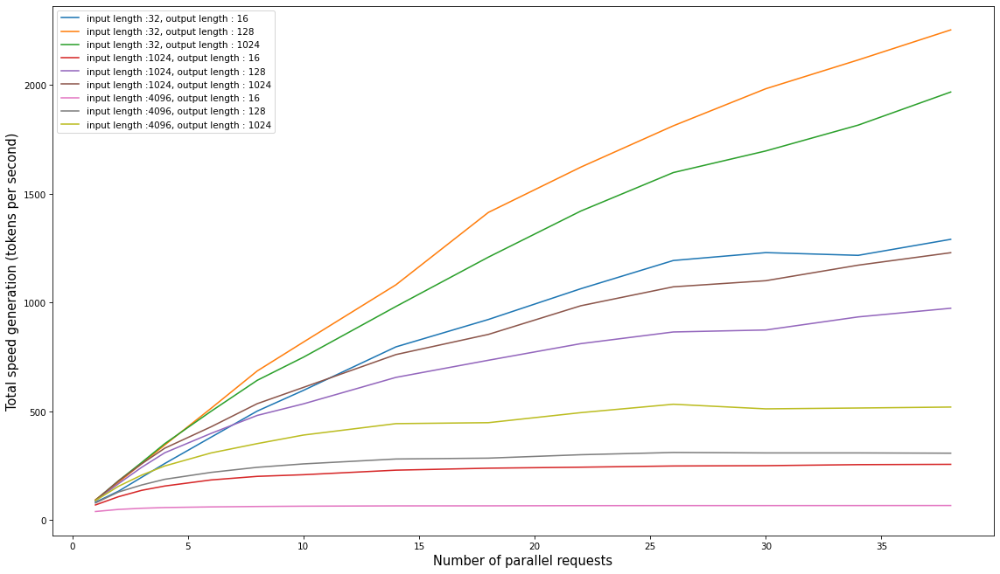
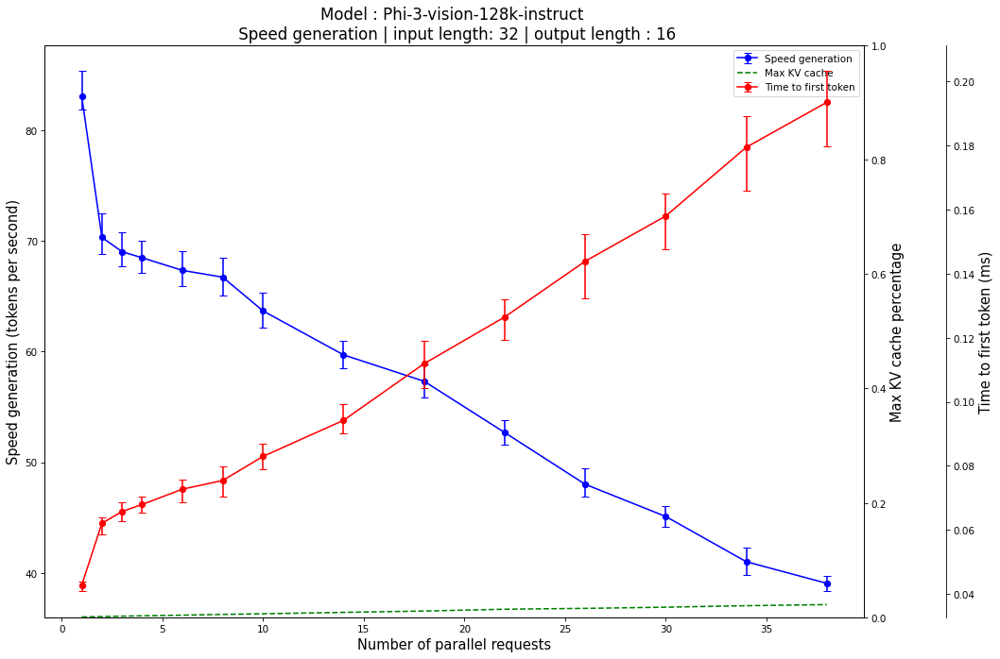

Model card for Phi-3-vision-128k-instruct on H100
=================================================

# Main metrics

The main metrics are summarized in the following table :   

|Metric|Value|
| :---: | :---: |
|Prompt ingestion speed|~15000 t/s |
|Mean generation speed for 10 parallel requests with a prompt of 1024 tokens and 128 tokens generated|~18 t/s for each request|
|Estimate of the max nb of tokens in KV cache|~125k tokens|

# Total generation speed

The following graph shows the total throughput with respect to the number of parallel queries for different scenarii :

  

# Generation speed and latency

The following graphs shows the throughput for each request with respect to the number of parallel queries. It also shows the time to first token and the corresponding gpu usage. The lines show the median whereas the bars show the 25th and 75th percentile

This graph is for prompt size of roughly 4096 tokens and 128 generated tokens :

This graph is for prompt size of roughly 32 tokens and 16 generated tokens :

# Parameters

The api from happy_vllm was launched using the following arguments :   

|Parameter|Value|
| :---: | :---: |
|model|Phi-3-vision-128k-instruct|
|step_live_metrics|0.01|
|max_queries|1000|
|request_rate|0|
|backend|happy_vllm|
|suite_id|2024-11-19, 10:00:48|
|model_name|Phi-3-vision-128k-instruct|
|happy_vllm_version|1.1.10|
|vllm_version|0.6.3.post1|
|host|0.0.0.0|
|port|8501|
|app_name|happy_vllm|
|api_endpoint_prefix|/api_vllm/rs|
|explicit_errors|False|
|allow_credentials|False|
|allowed_origins|['*']|
|allowed_methods|['*']|
|allowed_headers|['*']|
|uvicorn_log_level|info|
|ssl_keyfile|None|
|ssl_certfile|None|
|ssl_ca_certs|None|
|ssl_cert_reqs|0|
|root_path|None|
|lora_modules|None|
|chat_template|None|
|response_role|assistant|
|with_launch_arguments|True|
|max_log_len|None|
|prompt_adapters|None|
|return_tokens_as_token_ids|False|
|disable_frontend_multiprocessing|True|
|enable_auto_tool_choice|False|
|tool_call_parser|None|
|tool_parser_plugin||
|disable_fastapi_docs|False|
|tokenizer|None|
|skip_tokenizer_init|False|
|revision|None|
|code_revision|None|
|tokenizer_revision|None|
|tokenizer_mode|auto|
|trust_remote_code|True|
|download_dir|None|
|load_format|auto|
|config_format|auto|
|dtype|auto|
|kv_cache_dtype|auto|
|quantization_param_path|None|
|max_model_len|100000|
|guided_decoding_backend|outlines|
|distributed_executor_backend|None|
|worker_use_ray|False|
|pipeline_parallel_size|1|
|tensor_parallel_size|1|
|max_parallel_loading_workers|None|
|ray_workers_use_nsight|False|
|block_size|16|
|enable_prefix_caching|False|
|disable_sliding_window|False|
|use_v2_block_manager|False|
|num_lookahead_slots|0|
|seed|0|
|swap_space|4.0|
|cpu_offload_gb|0.0|
|gpu_memory_utilization|0.9|
|num_gpu_blocks_override|None|
|max_num_batched_tokens|None|
|max_num_seqs|256|
|max_logprobs|20|
|disable_log_stats|False|
|quantization|None|
|rope_scaling|None|
|rope_theta|None|
|enforce_eager|False|
|max_context_len_to_capture|None|
|max_seq_len_to_capture|8192|
|disable_custom_all_reduce|False|
|tokenizer_pool_size|0|
|tokenizer_pool_type|ray|
|tokenizer_pool_extra_config|None|
|limit_mm_per_prompt|None|
|mm_processor_kwargs|None|
|enable_lora|False|
|max_loras|1|
|max_lora_rank|16|
|lora_extra_vocab_size|256|
|lora_dtype|auto|
|long_lora_scaling_factors|None|
|max_cpu_loras|None|
|fully_sharded_loras|False|
|enable_prompt_adapter|False|
|max_prompt_adapters|1|
|max_prompt_adapter_token|0|
|device|auto|
|num_scheduler_steps|1|
|multi_step_stream_outputs|True|
|scheduler_delay_factor|0.0|
|enable_chunked_prefill|None|
|speculative_model|None|
|speculative_model_quantization|None|
|num_speculative_tokens|None|
|speculative_disable_mqa_scorer|False|
|speculative_draft_tensor_parallel_size|None|
|speculative_max_model_len|None|
|speculative_disable_by_batch_size|None|
|ngram_prompt_lookup_max|None|
|ngram_prompt_lookup_min|None|
|spec_decoding_acceptance_method|rejection_sampler|
|typical_acceptance_sampler_posterior_threshold|None|
|typical_acceptance_sampler_posterior_alpha|None|
|disable_logprobs_during_spec_decoding|None|
|model_loader_extra_config|None|
|ignore_patterns|[]|
|preemption_mode|None|
|served_model_name|None|
|qlora_adapter_name_or_path|None|
|otlp_traces_endpoint|None|
|collect_detailed_traces|None|
|disable_async_output_proc|False|
|override_neuron_config|None|
|scheduling_policy|fcfs|
|disable_log_requests|False|
|engine_use_ray|False|
|gpu_name|H100|
